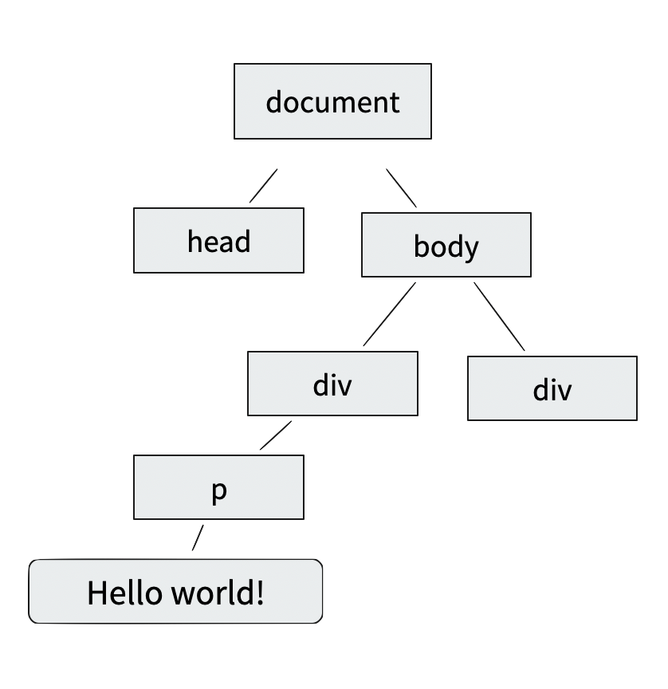

# 자바스크립트와 DOM

## 수업 목표

- 자바스크립트의 변수와 함수를 다뤄보자
- HTML을 프로그래밍적으로 다루기 위한 도구인 DOM에 대해 알아보자
- 자바스크립트로 HTML 요소를 조작하자

## 교육 노트

### 자바스크립트

#### 변하고 변하는 '변수'

> 컴퓨터 프로그래밍에서 변수(變數, variable) 또는 스칼라(scalar)는 아직 알려지지 않거나 어느 정도까지만 알려져 있는 양이나 정보에 대한 상징적인 이름이다.
>
> _\- [변수 (컴퓨터 과학) - 위키백과]_

[변수 (컴퓨터 과학) - 위키백과]: https://ko.wikipedia.org/wiki/%EB%B3%80%EC%88%98_(%EC%BB%B4%ED%93%A8%ED%84%B0_%EA%B3%BC%ED%95%99)

말 그대로 '변하는 수'. 정보를 담는 '상자'로 비유 가능하다. 어떤 이름이 적힌 상자를 찾으면 그 내용물을 볼 수 있다.

```js
x = 10
console.log(x) // 10 출력
```

수학에서 등의 변수를 다루는 것과 거의 동일하게 다룰 수 있다.

```js
x = 20 // 재 할당
y = 10
console.log(x + y) // 30 출력
```

자바스크립트는 보통 `var` 이나, `let`으로 변수를 만드는 것을 권한다.

```js
let x = 20
```

#### 함수

특정 작업을 수행하기 위한 코드의 집합으로, 코드를 재사용하기 위해 쓰는 기능이다. 변수를 설명할 때 같이 보았던 `console.log`가 함수로 그 안에는 정보를 출력하는 프로그램 코드가 담겼다.

선언

```js
function 이름() {
  //실행할 코드를 기술하세요
}
```

사용

```js
이름()
```

### DOM

DOM<sup>문서 객체 모델</sup>은 HTML, XML 문서를 프로그래밍으로 다루는 용도의 도구이다. 마크업의 구조적인 표현에 자바스크립트로 접근할 수 있도록 도우며, 문서의 구조, 스타일, 내용을 프로그래밍적으로 수정할 수 있게 돕는다.

정확히는 HTML 요소의 정보를 담은 **노드**(태그)와 **속성**, 프로그래밍적으로 마크업을 다루기 위해 **기능**(자바스크립트 함수)가 추가적으로 필요하다. 이 세가지를 트리 형태의 자료 구조로 나타낸 프로그래밍 도구이다.



### 자바스크립트로 DOM 선택하기

```js
var element = document.querySelector(‘head’);
console.log(element.nodeName); // head
```

`document.querySelector` 는 선택자의 정보를 통해 요소를 집어내는 자바스크립트 함수입니다.

```js
// HTML 요소가 브라우저에서 다 불러온 뒤에 아래의 함수가 실행이 됩니다.
window.onload = function () {
  // h1 태그를 가진 HTML 요소 생성
  var heading = document.createElement('h1')
  heading.innerText = 'Hello, World'
  document.body.appendChild(heading)
}
```

`document.createElement` 는 자바스크립트로 HTML 요소를 만드는 함수이다.

`document.body.appendChild` 는 `body` 라는 마크업 요소 내부에 새로운 요소를 넣는 함수이다.
