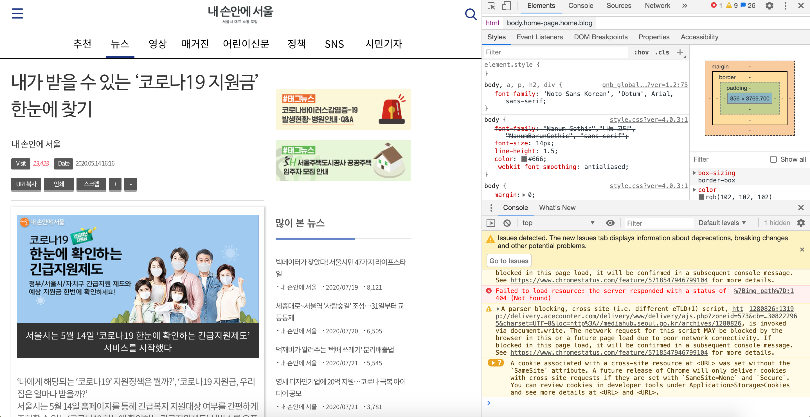
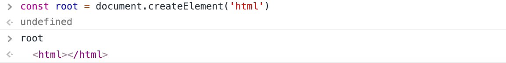
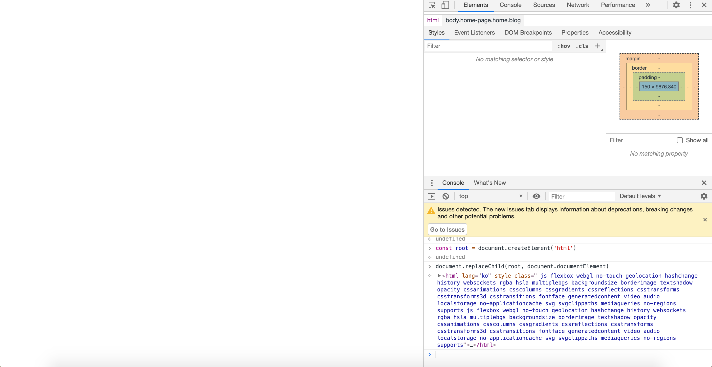
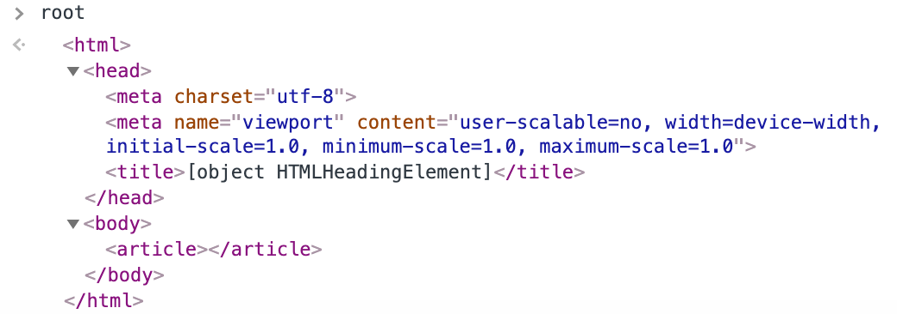
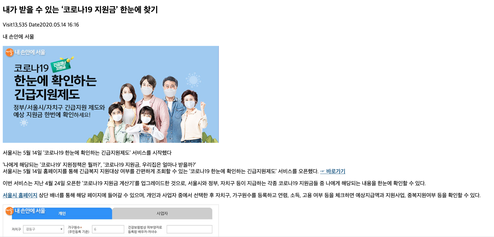
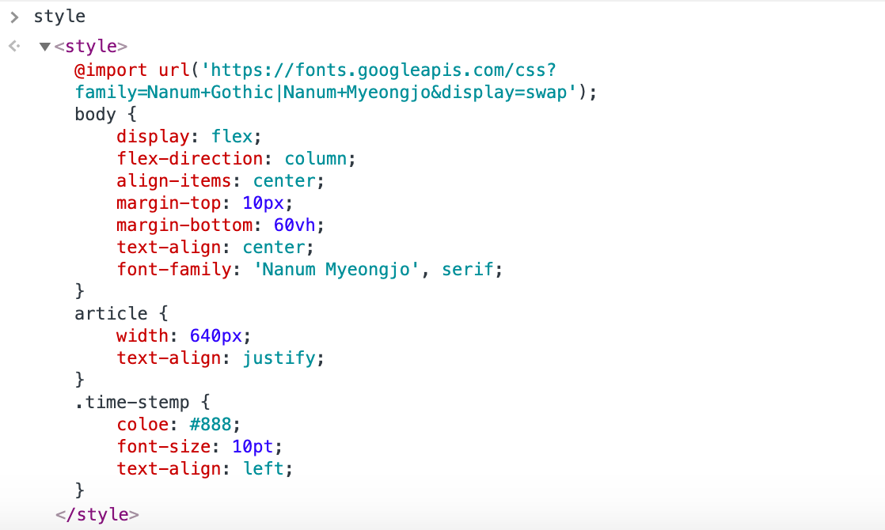

# 1. 브라우저 개발자 콘솔 내에서 접근해서 돌아가는 코드 만들기

## [ 수업 목표 ]

- 웹페이지에 있는 아티클 본문을 추출해서 새로운 구조로 만들어보아요!

- 스크립트 내 글의 제목, 글이 작성된 날짜, 글을 작성한 사람, 본문이 들어간 요소를 추출할 것 입니다.
- css 속성을 다루어 UI를 다듬어 볼게요.

## 수정 전 후 모습

| 원본 페이지                        | 우리가 만들어 볼 결과물               |
| ---------------------------------- | ------------------------------------- |
|  |  |

> [서울시 - 내 손안에 서울 | 내가 받을 수 있는 ‘코로나19 지원금’ 한눈에 찾기](http://mediahub.seoul.go.kr/archives/1280826)

## 방법

### 개발자 도구 창을 띄워요



우린 이곳에서 여러 가지를 시험해볼거에요!

### 각각의 요소들을 살펴보아요

> 글의 제목, 날짜, 글을 작성한 사람, 본문의 내용

개발자 도구의 마우스 포인터 모양의 요소 검사를 적절히 활용합니다.

`document.querySelector`를 이용해 각각의 요소를 확인해보아요

```js
// 글의 제목
const title = document.querySelector('#main > h1').innerText

// 글이 작성된 날짜
const timeStamp = document.querySelector('.date').innerText

// 글 작성자
const reporter = document.querySelector('.user').innerText

// 본문 내용
const content = document.querySelector('.pf-content').cloneNode(true)
```

위에서 확인한 요소들을 담을 변수를 만들어요

```js
const root = document.createElement('html')
```

지난 시간에 설명을 했죠? 요소를 만든다는 뜻이에요!

즉, `html`요소를 만든다는 거죠. 그리고 이를 `root`라는 이름을 가진 변수에 담아볼게요.

확인해볼까요?



이제 우리가 보고 있는 화면을 우리가 보고 싶은 것만 담겨질 `root`를 띄우기 위해 화면을 교체합니다.

```js
document.replaceChild(root, document.documentElement)
```

`Element.replaceChild(새 객체, 버릴 객체)` : 기존 요소와 새로운 요소를 바꿉니다.

어때요? 화면이 `<html></html>`만 담긴 `root` 로 화면이 교체되었죠.



`root` 안에 내용이 들어갈 자리를 만들어요.

```js
root.innerHTML = [
  '<head>',
  '<meta charset="utf-8">',
  '<meta name="viewport" content="user-scalable=no, width=device-width, initial-scale=1.0,minimum-scale=1.0, maximum-scale=1.0">',
  '</head>',
  '<body>',
  '<article>',
  '</article>',
  '</body>',
].join('')
```

innerHTML 프로미터를 사용해 `<html>` 태그에 요소들을 삽입할 수 있습니다.

확인해볼까요? `<html></html>`안에 위에서 삽입한 내용들이 담겨있죠?



이제 하나하나 담아볼게요!

`insertAdjacentHTML(position,node)`: 특정 위치에 노드를 추가합니다.

```js
// 본문 담기
article.append(content)
// 글을 작성한 사람 담기
article.insertAdjacentHTML('afterbegin', `<p>${reporter}</p>`)
// 작성일 담기
article.insertAdjacentHTML('afterbegin', `<p>${timeStamp}</p>`)
// 본문 제목 담기
article.insertAdjacentHTML('afterbegin', `<h1>${title}</h1>`)
```

한번 확인해볼까요?

제목, 날짜, 작성자, 본문으로만 이루어진 창을 확인 할 수 있죠?



### CSS 속성을 추가해 다듬어 볼까요?

> 글꼴, 정렬 등을 조정해 다듬기

위에서 html 요소를 담기위해 변수를 만들었죠? 이번에는 style요소를 담을 변수를 만들어요.

```javascript
const style = document.createElement('style')
```

style에 들어갈 요소들을 담아보아요.

```javascript
style.innerHTML = `@import url('https://fonts.googleapis.com/css?family=Nanum+Gothic|Nanum+Myeongjo&display=swap');`
body {
    display: flex;
    flex-direction: column;
    align-items: center;
    margin-top: 10px;
    margin-bottom: 60vh;
    text-align: center;
    font-family: 'Nanum Myeongjo', serif;
}
article {
    width: 640px;
    text-align: justify;
}
.time-stamp {
    color: #888;
    font-size: 10pt;
    text-align: left;
}`
```

`<style></style>`안에 내용들이 잘 담겨있는지 확인해봅시다.



이제 위에서 만든 article에 style을 담아볼게요.

```javascript
document.body.append(style)
```

확인해볼까요?


아직 time-stamp는 적용되지 않았군요. 클래스를 추가해서 스타일을 적용합니다.

```javascript
article.insertAdjacentHTML(
  'afterbegin',
  `<p class="time-stamp">${timeStamp}</p>`
)
```


수고하셨습니다! :clap: :clap:

### [ 다음 과정 ]

- 새로고침 한번 하시면 방금했던 모든 것들이 사라집니다.
- 이를 유저스크립트로 옮겨 영속성을 유지합니다.
