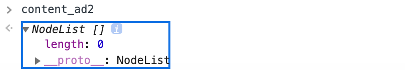

# 3. 여러 사이트에 적용하기

## [ 수업 목표 ]

- 서울시 사이트에서만 적용되는 유저스크립트를 다른 사이트에도 적용해보아요.

> [모바일 포털 뉴스 편집의 7가지 특징](http://www.bloter.net/archives/250689)

### 각각의 요소들을 살펴보아요

> 글의 제목, 날짜, 글을 작성한 사람, 본문의 내용

앞에서 한 것처럼 개발자 도구의 마우스 포인터 모양의 요소 검사를 적절히 활용합니다.

`document.querySelector` 를 이용해 각각의 요소를 확인해보아요.

```javascript
// 글의 제목
const title = document.querySelector('h1.headline').innerText

// 글이 작성된 날짜
const timeStamp = document.querySelector('.publish').innerText

// 글 작성자
const reporter = document.querySelector('.author--name').innerText

// 본문 내용
const content = document.querySelector('.article--content').cloneNode(true)
```

앞에서 한 것처럼 제목, 날짜, 작성자, 본문으로 이루어진 창을 한번 띄어볼까요?

```javascript
const article = document.querySelector('article')
article.append(content)
article.insertAdjacentHTML('afterbegin', `<p>${reporter}</p>`)
article.insertAdjacentHTML('afterbegin', `<p>${timeStamp}</p>`)
article.insertAdjacentHTML('afterbegin', `<h1>${title}</h1>`)
```

내용은 잘 담겨 있지만 기사를 보기에 불편하네요.

|     컨텐츠 내부 광고 예시1     |     컨텐츠 내부 광고 예시2      |
| :----------------------------: | :-----------------------------: |
|  |  |

`document.querySelector` 를 이용해 각각의 요소를 확인하고 제거합니다.

1. 확인하기

```javascript
// 광고 예시1
const content_ad1 = document.querySelector('.article--content-ad__container')
```

2. 제거하기

   element를 제거하기 위헤서 제거하고자하는 element와 그 element의 부모객체가 필요합니다.

   ```JavaScript
   content_ad1.parentNode.removeChild(content_ad1)
   ```

   

나머지 광고도 제거해볼게요.

`denim-shortcode__wrapper related-post--shortcode__wrapper`로 감싸인 광고가 두개 보이네요. 두개의 속성을 동시에 가져오기위해 `querySelectorAll` 을 사용해줍니다.

```javascript
const content_ad2 = document.querySelectorAll(
  '.denim-shortcode__wrapper related-post--shortcode__wrapper'
)
```

`querySelectorAll`을 사용하시면 NodeList 형식으로 나올텐데요. length가 0인 것을 보니 일치하는 속성이 없네요.



자세히 들여다보니 각각 `article` 태그로 감싸인 `class`가 다르네요.

| 예시1                           | 예시2                           |
| ------------------------------- | ------------------------------- |
|  |  |

title과 article을 각각 구분하여 제거하겠습니다.

먼저 title을 검사해보겠습니다. 복수 개가 있으니 `querySelectorAll`을 사용해보겠습니다.

```JavaScript
const ad_title = document.querySelectorAll('.denim-shortcode--title')
```


NodeList 형식으로 두 개의 요소가 출력되었네요. 반복문을 통해 한번에 요소를 제거해봅시다.

```javascript
ad_title.forEach(function (item) {
  item.parentNode.removeChild(item)
})
```

article도 마찬가지로 검사 후 제거해줍니다.


css 적용한 모습


광고가 모두 제거되었죠? 다음시간에는 이를 유저스크립트로 옮겨한 후 배포해봅시다.

### 유저스크립트로 옮겨볼까요

유저스크립트를 'bloter.net' 에서도 사용하기 위해 @match속성을 이용하여 추가해줍니다.

```javascript
// @match *://www.bloter.net/archives/*
```

'bloter.net'에 대한 `title`, `timeStamp`, `reporter`, `content`에 대한 요소 정보를 객체에 담아볼게요.

이전에 객체에 대해 간단하게 공부하고 갈게요!

**객체 생성**

```javascript
const world = { korea: '서울', germany: '베를린', usa: '워싱턴' }
```

- `{ }` 부분이 객체 리터럴입니다.
- `{ korea: '서울'}` : 한 쌍의 프로퍼티명과 값이 됩니다.
  - `korea` : 속성 이름 (key)
  - `'서울'` : 값 (value)
- 속성은 쉼표(,) 로 구분을 합니다.

**객체의 프로퍼티로 접근하기**

_(콘솔을 통해 확인해보세요!)_

```javascript
console.log(world.korea)
```

`객체.프로퍼티명` 을 통해 값(value)으로 접근할 수 있어요.

**새로운 프로퍼티 추가하기**

```javascript
world.france = '파리'

// result : {korea:'서울', germany:'베를린', usa:'워싱턴', france :'파리'}
```

`객체.새로운 프로퍼티 = 초기화값`으로 추가할 수 있습니다.

**프로퍼티 삭제하기**

```javascript
delete world.usa
console.log(world)

// result : {korea:'서울', germany:'베를린', france :'파리'}
```

**프로퍼티 찾기**

객체안에 찾고자 하는 프로퍼티가 있는지 확인을 하기위해서는 `in` 을 이용하여 진행합니다.

```javascript
console.log('korea' in world)

// true
```

- 이때 key값으로 조회해야합니다.

이제 sites라는 객체리터럴을 만들고 이 안에 데이터를 담아보겠습니다.

```javascript
const sites = {
  'mediahub.seoul.go.kr': {
    title: '#main > h1',
    timeStamp: '.date',
    reporter: '.user',
    content: '.pf-content',
  },
  'www.bloter.net': {
    title: '.headline',
    timeStamp: '.publish',
    reporter: '.author--name',
    content: '.article--content',
  },
}
```

현재 사이트의 도메인을 확인하고 확인한 정보를 바탕으로 `sites`에서 선택자 정보를 가져와 보겠습니다.

```javascript
const site = sites[location.hostname]
```

먼저 `location.hostname`으로 URL의 도메인 부분을 값으로 하는 DOMString을 가져옵니다. `location` 인터페이스는 객체가 연결된 장소(URL)를 표현합니다.

`location` 인터페이스에 대해 좀 더 알아보고 싶다면 [바로가기](https://developer.mozilla.org/ko/docs/Web/API/Location) 를 클릭해주세요!

site에 대한 광고도 앞에서 나온 것처럼 진행하시면 됩니다.

마지막으로 함수를 실행시킬 때 광고를 제거하기 위해 함수의 인자에 `adSelectors` 를 추가해줍니다.

### [ 다음 과정 ]

- 다른 사람들도 사용할 수 있도록 배포해봅시다.
